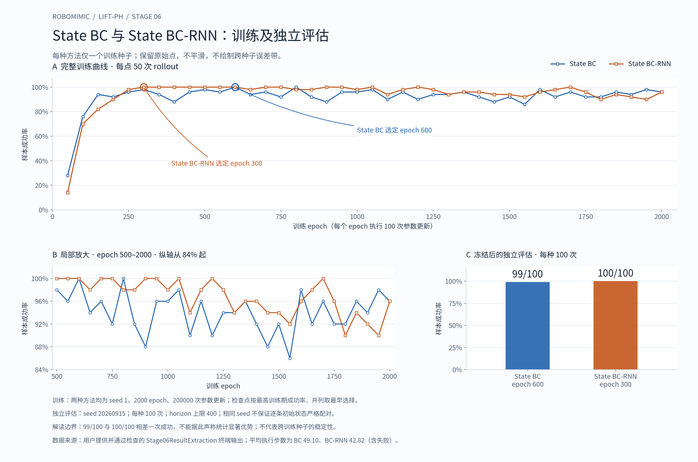

# robomimic Lift-PH 教学型复现：阶段 6 普通 State BC 与 State BC-RNN 比较报告

## 1. 本阶段范围与状态

本阶段在已完成的 State BC 与 State BC-RNN 实验基础上，核对共同设置和方法差异，提取完整训练期 rollout 曲线与冻结 checkpoint 后的独立评估结果，整理图表、解释实验边界，并准备项目入口文档与 Git 归档。

阶段 6 没有新增训练、没有重选 checkpoint、没有重新执行定量评估，也没有用独立评估成绩回选模型。报告依据阶段 5 交接记录，以及用户在当前会话实际执行并贴回的只读检查结果编写。

| 检查 | 当前证据状态 |
| --- | --- |
| `Stage06EvidencePreflight` | PASS，用户终端已确认 |
| `Stage06ComparisonConfigAudit` | PASS，用户终端已确认 |
| `Stage06ResultExtraction` | PASS，用户终端已确认 |
| 对比图与 CSV | 已根据上述提取结果生成，并核对数据与版式 |
| 概念理解讨论 | 已完成相关讲解与纠正；逐项记录见第 9 节 |
| `Stage06DocumentationInspection` | COMPLETE，用户终端已确认 |
| 本报告、项目 README 与附件放入用户仓库 | 文档生成时尚待用户执行 |
| 本阶段 commit / push / Git 总验收 | 文档生成时尚待执行，不预先标记 PASS |

这是一份文档准备时的状态快照。附件生成不等于已经写入用户本机仓库；后续归档结果以用户真实终端输出为准。

## 2. 已核验的仓库与证据基线

```text
Repository = /home/lx/robomimic
Branch = lift-ph-reproduction
Stage05BaselineHEAD = 46987cfc397ba04e28d6c65d9e3d3e690f34791b
OriginFetchURL = git@github.com:liuxue-lab/robomimic.git
OriginPushURL = git@github.com:liuxue-lab/robomimic.git
TrackingBranch = origin/lift-ph-reproduction
LocalHEAD = RemoteTrackingHEAD = GitHubRemoteHEAD
AheadBehind = 0 0
Worktree = clean
```

阶段 6 首步已核验以下 8 个文件的 SHA256，全部匹配交接记录。路径均相对用户仓库根目录。

| 证据 | 路径或标识 | 已核验 SHA256 |
| --- | --- | --- |
| BC 官方配置 | `reproduction/lift_ph/configs/state_bc_official.json` | `96c81356b0ccb562f0e8f737d1930201bd27c9895831d2419046fc495acc14b9` |
| BC-RNN 官方配置 | `reproduction/lift_ph/configs/state_bc_rnn_official.json` | `06c9380989e5d449038bc0c5a1a5789eb546961c7380ed4ece8217b985bd97c4` |
| BC 最终报告 | `reproduction/lift_ph/reports/04-state-bc-training.md` | `2d01d3ab622602db152564eb014e106894cd2e5bcc099dc2907bc97d9e9c54e9` |
| BC-RNN 最终报告 | `reproduction/lift_ph/reports/05-state-bc-rnn-training.md` | `d17ea5ab60a6d2819f34fe7f31e5a19b1394cf34d3bc29a6dda97f179acd6e5b` |
| BC checkpoint | epoch 600，完整路径见第 5 节 | `eda6c734695de403517d532b971402aa7ff938b36c375aece8d87ce730eb97f7` |
| BC-RNN checkpoint | epoch 300，完整路径见第 5 节 | `7d3ccdb2f6924cdccb2b21fb759ef188ee27f029d35247c895719221f6deac1c` |
| BC 独立评估日志 | 完整路径见第 6 节 | `3872d2193d2de3b59e3f8ed0a1345a7d23907c853478eaff7c3ff5b70855265a` |
| BC-RNN 独立评估日志 | 完整路径见第 6 节 | `e002f97b6790a2e5933d6502252f5ea734aab21f6846b9e77fe457d51fb57c11` |

哈希用于验证文件内容一致性，本身不是成功率证据。成功率来自实际 rollout 统计。

## 3. 比较条件

### 3.1 两种方法的共同设置

配置审计同时读取官方配置及实际训练使用的运行配置，以下共同设置全部通过一致性检查。

| 设置 | 已确认值 |
| --- | --- |
| 数据文件 | `/home/lx/robomimic/datasets/lift/ph/low_dim_v15.hdf5` |
| 轨迹划分 | `train` / `valid`，180 / 20 条轨迹 |
| 低维观测 | eef position 3、eef quaternion 4、gripper qpos 2、object 10，共 19 维 |
| 动作维度 | 7 |
| 训练种子 | 1 |
| 总 epoch / 每 epoch 更新数 | 2000 / 100 |
| 总参数更新次数 | 200000 |
| batch size / data workers | 100 / 0 |
| 观测归一化 | `hdf5_normalize_obs=False` |
| 优化器 | Adam，初始学习率 `0.0001`，L2 为 0 |
| 学习率调度 | `multistep`，`epoch_schedule=[]`，无已配置衰减里程碑 |
| GMM | 5 个分量，`min_std=0.0001`，`std_activation=softplus` |
| GMM eval | `low_noise_eval=True` |
| 每 epoch 验证步数 | 10 |
| 训练期 rollout | 开启，每 50 epoch 评估 50 次，horizon 上限 400，成功即终止 |
| 训练期 warmstart | 0 |
| checkpoint 保存 | 每 50 epoch 保存；开启按最佳 rollout 成功率保存，关闭按最佳 validation 保存 |
| 训练期视频 | 两者都关闭，rollout 评估仍开启 |

### 3.2 两种官方配置之间的全部差异

递归比较得到恰好 5 处差异。对实际运行配置再次比较，也仍恰好为这 5 个字段。

| 字段 | State BC | State BC-RNN |
| --- | --- | --- |
| `algo.actor_layer_dims` | `[1024,1024]` | `[]` |
| `algo.rnn.enabled` | `false` | `true` |
| `train.seq_length` | `1` | `10` |
| `experiment.name` | BC 专用名称 | BC-RNN 专用名称 |
| `train.output_dir` | `core/bc/.../trained_models` | `core/bc_rnn/.../trained_models` |

实际算法分别为 `BC_GMM` 和 `BC_RNN_GMM`。BC-RNN 使用两层 LSTM、hidden size 400；`actor_layer_dims=[]` 表示不使用 BC 中那组额外的 MLP 隐藏层，不表示没有策略网络或输出头。

每个 batch 分别包含 100×1 与 100×10 个序列位置；重叠窗口和末尾 padding 使这些位置不能被解释成十倍独立专家数据。相同更新次数也不等于相同计算量、监督位置数或实际耗时。

因此，本实验是两套官方方法配置在共同训练与评估协议下的比较，不是“只改变是否有记忆”的单因素消融。

### 3.3 每种方法的运行时改动

每种运行配置相对其官方配置，均只有两处改动：`experiment.name` 和 `experiment.render_video`。视频开关从 `true` 改为 `false`，没有关闭 rollout。

```text
BC runtime config:
runs/lift_ph/runtime_configs/state_bc_official_no_video_retry1.json
BC experiment name:
core_bc_lift_ph_low_dim_no_video_retry1

BC-RNN runtime config:
runs/lift_ph/runtime_configs/state_bc_rnn_official_no_video_20260916-041540-695444.json
BC-RNN experiment name:
core_bc_rnn_lift_ph_low_dim_no_video_20260916-041540-695444
```

BC 的历史视频内存故障和新实验名恢复记录见阶段 4 报告。阶段 6 使用已经完整成功运行的版本，不合并失败运行中的片段，也不删除历史证据。

## 4. 训练期 rollout 曲线

### 4.1 原始日志与提取结果

用户在本机读取的训练日志：

```text
BC:
runs/lift_ph/training/core/bc/lift/ph/low_dim/trained_models/core_bc_lift_ph_low_dim_no_video_retry1/20260915172631/logs/log.txt

BC-RNN:
runs/lift_ph/training/core/bc_rnn/lift/ph/low_dim/trained_models/core_bc_rnn_lift_ph_low_dim_no_video_20260916-041540-695444/20260916041920/logs/log.txt
```

两份日志都提取到恰好 40 条记录，epoch 顺序完整覆盖 50、100、…、2000，成功率均在 [0,1] 内。解析所得最高成功率、并列最佳点及最早最佳点与交接一致。

下面的数据来自用户实际终端输出；助手未直接读取用户机器上的训练日志完整字节。本阶段没有提供训练日志完整文件哈希，不补造该哈希。

### 4.2 全部 40 个检查点

每格为对应 checkpoint 在各自 50 次 rollout 上的样本成功率。两列不表示逐条初始状态已严格配对。

| Epoch | State BC | State BC-RNN |
| ---: | ---: | ---: |
| 50 | 0.28 | 0.14 |
| 100 | 0.76 | 0.70 |
| 150 | 0.94 | 0.82 |
| 200 | 0.92 | 0.90 |
| 250 | 0.96 | 0.98 |
| 300 | 0.98 | 1.00 |
| 350 | 0.94 | 1.00 |
| 400 | 0.88 | 1.00 |
| 450 | 0.96 | 1.00 |
| 500 | 0.98 | 1.00 |
| 550 | 0.96 | 1.00 |
| 600 | 1.00 | 1.00 |
| 650 | 0.94 | 0.98 |
| 700 | 0.96 | 1.00 |
| 750 | 0.92 | 1.00 |
| 800 | 1.00 | 0.98 |
| 850 | 0.92 | 0.98 |
| 900 | 0.88 | 1.00 |
| 950 | 0.96 | 1.00 |
| 1000 | 0.96 | 0.98 |
| 1050 | 0.98 | 1.00 |
| 1100 | 0.90 | 0.94 |
| 1150 | 0.96 | 0.98 |
| 1200 | 0.90 | 1.00 |
| 1250 | 0.94 | 0.98 |
| 1300 | 0.94 | 0.94 |
| 1350 | 0.96 | 0.96 |
| 1400 | 0.92 | 0.96 |
| 1450 | 0.88 | 0.94 |
| 1500 | 0.92 | 0.94 |
| 1550 | 0.86 | 0.92 |
| 1600 | 0.98 | 0.96 |
| 1650 | 0.92 | 0.98 |
| 1700 | 0.96 | 1.00 |
| 1750 | 0.92 | 0.96 |
| 1800 | 0.92 | 0.90 |
| 1850 | 0.96 | 0.94 |
| 1900 | 0.94 | 0.92 |
| 1950 | 0.98 | 0.90 |
| 2000 | 0.96 | 0.96 |

可复用数据：[stage06-training-rollouts.csv](../results/stage06-training-rollouts.csv)。

### 4.3 图件



- 图 A 显示全部 40 点。连线仅帮助阅读，不表示未评估 epoch 的实测值。
- 图 B 重复显示 epoch 500～2000 的局部区间，明确标注纵轴从 84% 起；完整曲线仍由图 A 保留。
- 图 C 使用独立评估结果，分母为每种方法 100 次，与训练期每点 50 次区分。

图中没有平滑、筛选有利区间或跨种子误差条。40 个相邻 checkpoint 来自同一训练运行，不是 40 个独立训练种子。

矢量版本：[stage06-bc-vs-bc-rnn.svg](../media/stage06-bc-vs-bc-rnn.svg)。

## 5. checkpoint 选择与固定预算

选择规则在训练前已确定：最高训练期样本成功率，并列时取最早 epoch。阶段 6 只复核已经冻结的选择。

| 项目 | State BC | State BC-RNN |
| --- | --- | --- |
| 最高训练期成功率 | 1.00 | 1.00 |
| 并列最佳 epoch | 600、800 | 300、350、400、450、500、550、600、700、750、900、950、1050、1200、1700 |
| 选定 epoch | 600 | 300 |
| epoch 2000 成功率 | 0.96，即 48/50 | 0.96，即 48/50 |

“最早”仅指每隔 50 epoch 检查一次的已观测点，不涵盖未评估的中间 epoch。两者都完整训练到 2000，选定点不代表训练停止点。

```text
BC checkpoint:
runs/lift_ph/training/core/bc/lift/ph/low_dim/trained_models/core_bc_lift_ph_low_dim_no_video_retry1/20260915172631/models/model_epoch_600_Lift_success_1.0.pth

BC-RNN checkpoint:
runs/lift_ph/training/core/bc_rnn/lift/ph/low_dim/trained_models/core_bc_rnn_lift_ph_low_dim_no_video_20260916-041540-695444/20260916041920/models/model_epoch_300_Lift_success_1.0.pth
```

如果唯一目标是按上述规则取得最终选中的 checkpoint，那么首次达到 100% 后，再出现 100% 也不会替换它，后续更不可能超过 100%。所以本次继续训练的理由不是“可能出现更高的样本成功率”，而是完成既定 2000 epoch 预算并获得完整训练曲线。

未来可以预先设计“首次达到阈值即停止”的协议，但应明确报告提前停止规则与不同的实际预算。一次训练期 50/50 不等于所有初始状态成功，也不能替代冻结后的独立评估。

训练后期结果发生波动，不能单凭这组曲线把变化全部归因于过拟合或策略退化；策略变化和评估随机性都可能影响观测结果。

## 6. 独立评估与统计口径

### 6.1 固定协议及结果

```text
EvaluationSeed = 20260915
RolloutsPerMethod = 100
HorizonLimit = 400
CheckpointSelectionUsesIndependentEvaluation = False
```

| 指标 | State BC | State BC-RNN |
| --- | ---: | ---: |
| Return | 0.99 | 1.00 |
| Success_Rate | 0.99 | 1.00 |
| Num_Success | 99 | 100 |
| 平均 Horizon，所有回合 | 49.10 | 42.82 |

```text
BC independent evaluation log:
runs/lift_ph/evaluation/state_bc_epoch600_seed20260915_100rollouts_20260915-190933.log

BC-RNN independent evaluation log:
runs/lift_ph/evaluation/state_bc_rnn_epoch300_seed20260915_n100_20260916041920/evaluation.log
```

可复用数据：[stage06-independent-evaluation.csv](../results/stage06-independent-evaluation.csv)。额外各 5 次视频评估均在前序阶段完成并由用户观看确认，不能合并进这里的 100 次评估。

### 6.2 一次 rollout 与平均 Horizon

一次 rollout 是从环境重置开始，由冻结后的策略逐步读取观测、生成动作、推进环境，直到成功或其他终止条件结束的一回合评估。专家轨迹用于训练；评估轨迹由策略闭环执行产生，不是按顺序回放某条专家动作记录。评估时模型参数保持不变。

若第 i 次 rollout 执行 L_i 步，则本次平均 Horizon 为全部 100 回合步数之和除以 100。BC 的 49.1 包含 99 次成功和 1 次失败；失败回合不会被排除。

“仅成功回合的平均步数”需要单独筛选成功轨迹再求平均，BC 的分母应为 99，当前汇总日志没有给出这一条件均值。本报告不假定那次失败一定执行了 400 步，也不据此反推出未经验证的成功回合均值。

Horizon 的单位是控制步数，不是秒。成功即终止、失败回合和最长步数上限都会影响该平均值，因此 49.10 与 42.82 不能直接写成“成功抓取平均耗时”，也不能单独证明动作更快或更平滑。

### 6.3 同种子与逐条配对

相同评估 seed 不能单独证明两模型第 i 次 rollout 的初始状态相同。随机数调用顺序、次数或实现中的不同随机源可能使环境重置序列不同；本报告也不反向断言本次初始状态一定不同。

严格配对需要按回合编号记录并核对实际执行前的完整环境初始状态，或确实逐条恢复同一组已保存状态。同一记录格式下逐条状态记录的哈希可用于一致性核对；checkpoint、配置或 seed 文本的哈希不能替代初始状态证据。本次没有这样的逐条证据，不作严格配对比较结论。

## 7. 能支持的结论与限制

本次各使用训练 seed 1，执行相同数量的参数更新，并采用一致的 checkpoint 选择与独立评估协议。两者的最高训练期样本成功率均为 50/50；BC-RNN 在更早的已测检查点达到该值。冻结后各 100 次评估中，BC-RNN 比 BC 多成功 1 次，样本成功率高 1 个百分点。

可采用的结论是：在本次单训练种子实验中，BC-RNN 的独立评估样本成功率为 100%，BC 为 99%；现有证据不足以证明 BC-RNN 显著或稳定优于 BC。

| 限制 | 对解释的影响 |
| --- | --- |
| 每种方法仅 1 个训练种子 | 不能得到跨训练随机性的稳定性结论 |
| 独立评估仅各 100 次 | 多成功 1 次不证明真实成功概率必然更高 |
| 共同 seed 但无逐条初始状态记录 | 不能声称严格配对 |
| 网络与序列长度同时改变 | 不能把差异单独归因于“记忆” |
| 只统一更新次数 | 不是统一 FLOPs 或墙钟训练预算 |
| 平均 Horizon 含失败 | 不直接代表成功轨迹的平均完成时长 |
| 40 点来自各自同一次训练 | 不能据此构造跨种子均值与标准差 |
| 没有视觉、真机或分布外评估 | 结论限定在当前 Lift-PH low-dim 实验 |

独立评估与统计显著性检验是不同概念。本次已经做了独立评估，阶段 6 没有另做统计显著性检验，也没有构造置信区间。进一步研究稳定性应另行预设多训练种子、模型选择与评估协议；不能通过反复评估挑最好结果来消除当前局限。

## 8. 资源记录与历史故障边界

本阶段不新增资源测量。两次完整训练总耗时、统一口径的完整训练峰值显存等没有可靠齐全的比较记录，相关比较指标记为未记录。

BC 阶段 4 的日志曾记录进程 Memory Usage 最大 2970 MB；BC-RNN 有若干时点的内存快照。这些记录不等于两者统一口径的全程系统内存或 GPU 峰值显存，不能拿来做等预算效率结论。BC-RNN 独立评估耗时 104.79 秒也不能冒充训练总耗时。

BC 的历史训练期视频内存故障、复用实验名导致的后台交互故障，已在阶段 4 解决并保留记录；BC-RNN 的 CUDA 统计初始化与脚本语法问题发生在前向审计阶段，其正式训练一次完成。本阶段没有因这些历史问题重装环境或重启训练。

## 9. 理解讨论与纠正记录

| 主题 | 本次讨论后的正确口径 | 对话证据情况 |
| --- | --- | --- |
| 选定 epoch 与耗时 | 两者训练轮数和更新次数相同，实际耗时不一定相同 | 用户正确复述选择规则；“时长相同”已解释纠正，未单独要求完整复答 |
| 首次 100% 后为何继续 | 后续不能超过 100%；当前规则下也不替换更早并列点；继续是为了固定预算与完整曲线 | 用户主动提问，已详细解释 |
| 99/100 与 100/100 | 只能表述本次样本结果，不能证明显著或稳定优势 | 用户纠正后明确复答，PASS |
| 相同 seed 与配对 | 不能仅凭 seed 判断逐条相同；哈希应针对对应的实际完整初始状态记录 | 用户回答不能、提出哈希核对；对象与证据边界已澄清 |
| 平均 Horizon | 全部 100 次尝试平均步数，成功失败都包括 | 用户先误认为排除失败，纠正后完整复答，PASS |
| rollout 与轨迹 | 冻结策略从重置到回合结束生成一条评估轨迹；成功失败都算一次 | 已结合用户关于“尝试”和轨迹的追问解释 |

本表保留纠正过程，不把错误初答或简短判断冒充完整理解证明。阶段 4、5 已通过的理解问答没有重新进行整套重复验收。

## 10. 项目目录、附件与待执行归档

用户实际目录检查确认，归档前 `reproduction/lift_ph` 有 24 个已列出的文件，包含原有配置、环境、阶段 0～5 报告、数据审计脚本及目录占位文件。项目级 README 和本阶段报告此前均不存在。仓库根 README 是上游项目入口，本阶段新增项目级入口。

本阶段新增文件范围为以下 7 项：

```text
reproduction/lift_ph/README.md
reproduction/lift_ph/reports/06-state-bc-vs-bc-rnn-comparison.md
reproduction/lift_ph/results/stage06-training-rollouts.csv
reproduction/lift_ph/results/stage06-independent-evaluation.csv
reproduction/lift_ph/media/stage06-bc-vs-bc-rnn.png
reproduction/lift_ph/media/stage06-bc-vs-bc-rnn.svg
reproduction/lift_ph/scripts/plot_stage06_comparison.py
```

两份 CSV 是从已验收终端提取结果整理的轻量数据表；图件与绘图脚本支持复用。原始训练产物仍保留在被忽略的 `runs/`，不复制 checkpoint、原始日志、视频或数据集进入 Git。

绘图脚本默认从其上级项目目录的 `results/` 读取 CSV，输出到 `media/`；可用 `--output-dir` 指定预览位置，现有环境无需为查看图件重装。具体重绘方法见[项目 README](../README.md)。

后续依次执行：把已核验附件放入上述位置、检查文件和链接、精确暂存、普通 commit、普通 push 到个人 `origin/lift-ph-reproduction`，最后核对本地、跟踪分支、GitHub HEAD、领先/落后和工作区。只有完成这些实际步骤后，才标记阶段 6 与核心七阶段的最终归档验收通过。

## 11. 来源与追溯

- [阶段 4：State BC 训练与评估报告](04-state-bc-training.md)
- [阶段 5：State BC-RNN 训练与评估报告](05-state-bc-rnn-training.md)
- [阶段 3：官方配置审计](03-state-bc-config-audit.md)
- 当前会话用户执行并贴回的 `Stage06EvidencePreflight`、`Stage06ComparisonConfigAudit`、`Stage06ResultExtraction` 与 `Stage06DocumentationInspection` 输出。
- `robomimic-lift-ph-stage-05-handoff.md`：阶段 5 完成后的上下文、历史路径及证据边界。该独立交接文件不假定已经提交到仓库。

本报告没有新增官方论文均值、标准差、效率排名或其他未核验的外部结论。全部数值限定于本项目已经记录的运行和评估。
